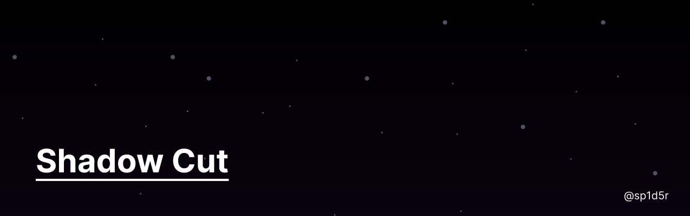

  

# Shadow Cut

  📄🔒
  
  💬
  
  🛠️
  

## Description

Shadow Cut is a brand that aims to make cutting longer form videos into TikTok format on browser. With Shadow Cut, you can upload a video, crop it using a black box overlay, and generate a new video that only follows the video inside the box.

## Features

- 📹 Upload a video file
- 🖼️ Add a black box overlay to the video
- 🕹️ Adjust the position of the black box
- ✂️ Crop and generate a new video that only follows the video inside the box
- 🧠 Automatically determine where to position the black box using AI (coming soon!)

## Technologies

Shadow Cut is built using the following technologies:

- React: A JavaScript library for building user interfaces
- video.js: A web video player built with HTML5 and CSS
- FFmpeg.js: A JavaScript port of FFmpeg that can run in the browser
- CSS: Cascading Style Sheets for styling the user interface

## Getting Started

To get started with Shadow Cut, simply clone this repository and run the following command:

